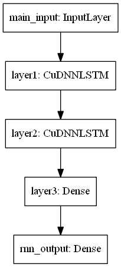

<h1> Language Identification System </h1>

 This is a simple implementation of language identification system. Dataset from users was collected for 4 different languages(Hindi,Telugu,Tamil and English)
 

</img>

<h2>How is it done?</h2>
<ul type='disc'>
<li>After preprocessing the audio, the Mel-Frequency Cepstral Coefficients (MFCCs), a 39 dimensional vector containing energy, velocity and acceleration coefficients are obtained</li>
<li>A simple LSTM model can be trained.</li>
</ul>
<h2>Limitations</h2>

 Limited dataset had produced poor test accuracy of 79%. Certain non-native speakers unwittingly influenced the language. A transfer learning based approach can significantly improve performance.
<h2>References</h2>
<ul type='disc'>
<li>Earliest attempts - audio through multiple translators utilizing domain specific knowledge – cited by Bartz et. al [Hasso Plattner Institute, University of Potsdam] in “Language Identification Using Deep Convolutional Recurrent Neural Networks". </li>
<li>LIFAS system converts the problem into an object classification task – uses RCNN and has highest in-class accuracy of 89% – spectrograms on the fly, complex networks.</li>
<li>Venkatesan et. al Automatic Language Identification using Machine learning Techniques, IEEE Xplore. </li>
</ul>
